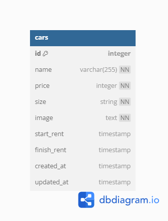

### SYNRGY 7 Challenge 5 RESTful API FSW 4 Muhammad Fachrian Noor

### Instruksi

1. Clone atau Download ke lokal
2. Masuk ke direktori yang sudah di Clone/Download `cd your-name-directory`
3. Selanjutnya menduplikasi file `.env.example` ke `.env` dan diisi dengan Database PostgreSQL milik Anda dan juga Cloudinary
4. Jalankan perintah `npm install` untuk menginstall library yang dibutuhkan
5. Jalankan perintah `npx knex migrate:latest` untuk membuat tabel melalui migration
6. Jalankan perintah `npx knex seed:run` untuk mengisi data di tabel dengan data seeder
7. Untuk langkah terakir jalankan perintah `npm run start` untuk menjalankan program
8. (optional) jalankan perintah `npm run dev` untuk menjalankan program development

### List Endpoints

| API Endpoint    | Method | Deksripsi                        |
| --------------- | ------ | -------------------------------- |
| `/api/cars`     | GET    | Menampilkan seluruh data mobil   |
| `/api/cars/:id` | GET    | Menampilkan data mobil sesuai ID |
| `/api/cars`     | POST   | Menambahkan data mobil baru      |
| `/api/cars/:id` | PUT    | Mengubah data mobil sesuai ID    |
| `/api/cars/:id` | DELETE | Menghapus data mobil sesuai ID   |

### Contoh Data

- **Menampilkan seluruh data mobil**

  - **Request**

    - Endpoint : `/api/cars`
    - Method : `GET`

  - **Response**

  ```json
  {
    "status": true,
    "message": "Success Get All Cars",
    "total": 3,
    "data": {
      "cars": [
        {
          "id": 1,
          "name": "Mobil 1",
          "price": 700,
          "size": "Small",
          "image": "https://res.cloudinary.com/dpavtrweo/image/upload/v1715801964/challenge5/hoqqtv26r8qgv46jexlm.jpg",
          "start_rent": "2024-05-16T12:22:09.482Z",
          "finish_rent": "2024-05-16T12:22:09.482Z",
          "created_at": "2024-05-16T12:22:09.482Z",
          "updated_at": null
        },
        {
          "id": 2,
          "name": "Mobil 2",
          "price": 500,
          "size": "Medium",
          "image": "https://res.cloudinary.com/dpavtrweo/image/upload/v1715801963/challenge5/wjkgvj4akcrenh1mmwec.jpg",
          "start_rent": "2024-05-16T12:22:09.482Z",
          "finish_rent": "2024-05-16T12:22:09.482Z",
          "created_at": "2024-05-16T12:22:09.482Z",
          "updated_at": null
        },
        {
          "id": 3,
          "name": "Mobil 3",
          "price": 900,
          "size": "Large",
          "image": "https://res.cloudinary.com/dpavtrweo/image/upload/v1715801963/challenge5/ifpfouew8d4wlv8zm3in.jpg",
          "start_rent": "2024-05-16T12:22:09.482Z",
          "finish_rent": "2024-05-16T12:22:09.482Z",
          "created_at": "2024-05-16T12:22:09.482Z",
          "updated_at": null
        }
      ]
    }
  }
  ```

- **Menampilkan data mobil sesuai ID**

  - **Request**

    - Endpoint : `/api/cars/1`
    - Method : `GET`

  - **Response**

  ```json
  {
    "status": true,
    "message": "Success Get Cars By Id",
    "total": 3,
    "data": {
      "cars": [
        {
          "id": 1,
          "name": "Mobil 1",
          "price": 700,
          "size": "Small",
          "image": "https://res.cloudinary.com/dpavtrweo/image/upload/v1715801964/challenge5/hoqqtv26r8qgv46jexlm.jpg",
          "start_rent": "2024-05-16T12:22:09.482Z",
          "finish_rent": "2024-05-16T12:22:09.482Z",
          "created_at": "2024-05-16T12:22:09.482Z",
          "updated_at": null
        }
      ]
    }
  }
  ```

- **Menambahkan data mobil baru**

  - **Request**

    - Endpoint : `/api/cars`
    - Method : `POST`
    - Body :

      | Key         | Value                    |
      | ----------- | ------------------------ |
      | name        | Mobil 4                  |
      | price       | 300                      |
      | size        | Large                    |
      | image       | file: mobil4.png         |
      | start_rent  | 2024-05-16T12:22:09.482Z |
      | finish_rent | 2024-05-17T12:22:09.482Z |

  - **Response**

  ```json
  {
    "status": true,
    "message": "Success Add Cars"
  }
  ```

- **Mengubah data mobil sesuai ID**

  - **Request**

    - Endpoint : `/api/cars/4`
    - Method : `PUT`
    - Body :

      | Key         | Value                    |
      | ----------- | ------------------------ |
      | name        | Ubah Mobil 4             |
      | price       | 400                      |
      | size        | Small                    |
      | image       | file: mobil4New.png      |
      | start_rent  | 2024-05-18T12:22:09.482Z |
      | finish_rent | 2024-05-19T12:22:09.482Z |

  - **Response**

  ```json
  {
    "status": true,
    "message": "Success Update Cars"
  }
  ```

- **Menghapus data mobil sesuai ID**

  - **Request**
    - Endpoint : `/api/cars/4`
    - Method : `DELETE`
  - **Response**

  ```json
  {
    "status": true,
    "message": "Success Delete Cars"
  }
  ```

### Entity Relationship Diagram (ERD)


